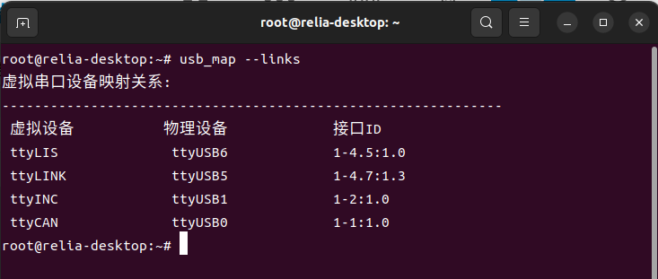

# usb_map

Linux 下 USB 串口设备映射查询与 4G 模块检测工具集。

## 程序

### usb_map

遍历 `/dev` 下的串口设备以及 `ttyUSB*` / `ttyACM*` 物理设备，通过 libudev 查询其 USB 接口 ID 并展示映射关系。

```
用法: usb_map [--links | --phys | --all]
  --links  仅显示虚拟设备（符号链接）
  --phys   仅显示物理设备
  --all    显示全部（默认）
```



### find_4g_module

遍历 `/dev/ttyUSB0-9`，逐个发送 `AT\r\n` 指令，通过响应中是否包含 `OK` 来定位移远 4G 模块所在的串口。

```
用法: find_4g_module
```

## 依赖

| 依赖 | Ubuntu 包名 |
|------|-------------|
| CMake ≥ 3.10 | `cmake` |
| libudev | `libudev-dev` |
| spdlog | `libspdlog-dev` |
| g++ (C++20) | `build-essential` |

## 构建

```bash
# 安装依赖
sudo apt install -y build-essential cmake libudev-dev libspdlog-dev

# 编译
cmake -B build -DCMAKE_PREFIX_PATH=/usr
cmake --build build
```

输出在 `build/bin/` 目录下。

> 若使用 vcpkg 管理 spdlog，请将 `CMAKE_PREFIX_PATH` 指向 vcpkg 安装路径。
